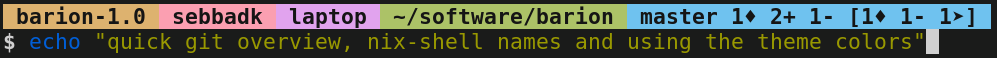

# Barion - Fast and Simple Prompt
Barion is a compiled fast prompt to use across any shell.



## Features
The special features of Barion is support for showing `nix-shell`, showing a compact `git` status overview and optional `fish_prompt`-like view of the exit status of last command.

## Building
Building Barion requires just [Crystal](https://crystal-lang.org/) as there is no dependencies. Running `crystal build --release prompt.cr -o barion` should be everything necessary. There is also an environment set up for building via [nix](https://nixos.org/), so `nix-build` will take care of everything.

## Setup
All these setup commands are

### `bash`
If you want to keep your prompt inside nix shells, you can use the below code:

```bash
function barion_prompt {
	barion $1
	PS1="\[\e[1m\]\$\[\e[m\] "
}
PROMPT_COMMAND="barion_prompt \$?"
```

If the fish-style status-code display is not needed, simply drop the parameter:

```bash
function barion_prompt {
	barion
	PS1="\[\e[1m\]\$\[\e[m\] "
}
PROMPT_COMMAND="barion_prompt"
```

(The `\[` and `\]` marks non-printing characters to avoid glitches in prompt rendering [see GNU Bash manual](https://www.gnu.org/software/bash/manual/bash.html#Controlling-the-Prompt))

### `fish`
For fish we can just use the `fish_prompt` hook.

```fish
function fish_prompt
	barion $status
	echo "\e[1m\$\e[m "
end
```

Again, if the status is not needed or wanted, just remove the parameter:

```fish
function fish_prompt
	barion
	echo "\e[1m\$\e[m "
end
```

### `zsh`
With zsh we use the `precmd` hook to achieve the same effect as the other shells.

```zsh
function precmd {
	barion $?
}
PROMPT="%B\$%b "
```

If you don't want the fish-style exit codes shown in the prompt, just remove the parameter passed to barion.

```zsh
function precmd {
	barion
}
PROMPT="%B\$%b "
```

### Other shells
Use some sort of available hook to call Barion and write the lower prompt line in the native way of the shell.

